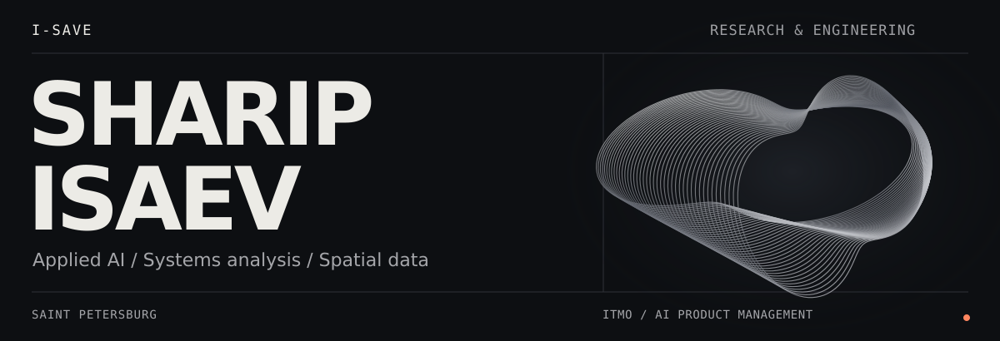
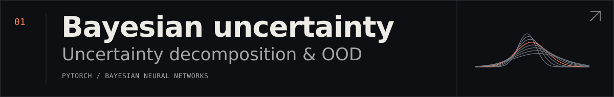
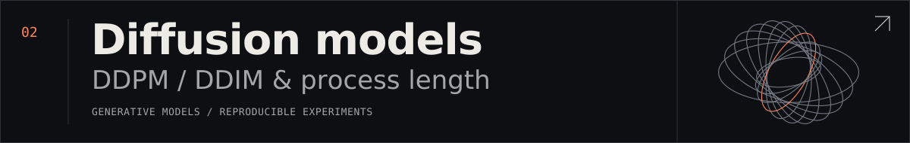
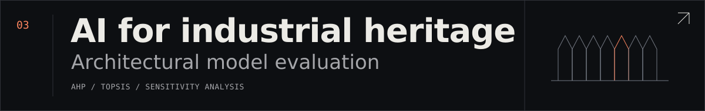
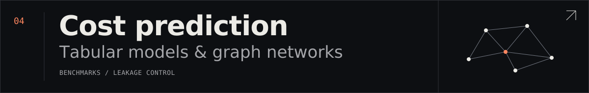

<picture>
  <source media="(max-width: 600px)" srcset="assets/editorial/hero-mobile.svg">
  
</picture>

  
  
  

[English](README.md) / **Русский**

<table>
<tr>
<td valign="top">
<h3>От инженерии к прикладному ИИ.</h3>

Я Шарип, инженер-строитель и системный аналитик. Исследую надёжность машинного обучения, пространственные данные и методы принятия решений.

<strong>Сейчас:</strong> магистратура «Управление ИИ-продуктами», <a href="https://aiproduct.itmo.ru/">ИТМО × Альфа-Банк</a>. Сообщество AI Talent Hub.

</td>
<td width="124" align="center" valign="middle">

</td>
</tr>
</table>

## Избранные проекты

## Направления и инструменты

**Надёжность ИИ** / неопределённость, OOD, воспроизводимые эксперименты  
**Пространственный анализ** / GeoAI, графы, многокритериальный выбор  
**Инженерные задачи** / BIM, параметрическое проектирование, LLM

`Python` `PyTorch` `scikit-learn` `NumPy` `pandas` `SHAP`  
`Revit` `Dynamo` `Grasshopper` `Figma`

Образование, опыт и достижения

### Образование

| Период | Вуз и программа |
| :--- | :--- |
| **2026 — сейчас** | **Университет ИТМО** · Магистратура **«Управление ИИ-продуктами / AI Product Management»**, 02.04.03 «Математическое обеспечение и администрирование информационных систем». Программа совместно с **Альфа-Банком**. |
| **2025–2026** | **Санкт-Петербургский политехнический университет Петра Великого (СПбПУ)** · Передовая инженерная школа **«Цифровой инжиниринг»**. Обучение в магистратуре **27.04.03 «Системный анализ и управление»**; в 2026 году перевёлся в ИТМО. |
| **2021–2025** | **СПбПУ** · Инженерно-строительный институт. **Бакалавриат с отличием**, 08.03.01 «Строительство», профиль «Промышленное и гражданское строительство уникальных зданий и сооружений». |

[Описание программы ИТМО](https://abit.itmo.ru/program/master/ai_product) · [ИТМО × Альфа-Банк / AI Talent Hub](https://aiproduct.itmo.ru/)

### Опыт и достижения

- **Газпром ЦПС** (2023–2024) — инженерная и проектная работа.
- **Атомэнергопроект, Росатом** (2024–2025) — проектирование строительных конструкций.
- **ML-хакатон МФТИ × РЖД** (2025) — победитель; оптимизация назначения локомотивов.
- **СПбПУ** (2025) — диплом бакалавра с отличием.

### Полный набор инструментов

SciPy, XGBoost, JAX, AutoCAD, Civil 3D, AHP, TOPSIS, Python automation.

---

Открыт к сотрудничеству в исследованиях ИИ, пространственной аналитике и инженерных проектах.

[isaev.list@list.ru](mailto:isaev.list@list.ru) / [Telegram](https://t.me/I_SA_VE) / [ResearchGate](https://www.researchgate.net/profile/Sharip-Isaev) / [Web of Science](https://www.webofscience.com/wos/author/record/OQK-6650-2025)
